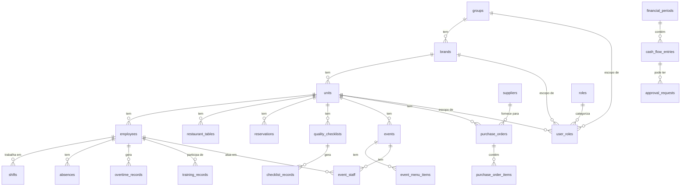

## 1. VISÃO GERAL DO PROJETO

**Nome:** `kph-os-operacao`

**Descrição:** Dashboard operacional do Grupo KPH — módulo "Operação" do sistema OS (Operating System) da holding. Permite gerenciar mesas em tempo real, auditorias de qualidade, KPIs de performance operacional e eventos, por unidade (unit) selecionada.

**Propósito:** Centralizar a operação diária dos restaurantes/unidades do Grupo KPH em uma interface web, substituindo processos manuais (planilhas, papel) por um painel interativo com dados em tempo real do Supabase.

**Stack tecnológica:**

| Camada | Tecnologia | Versão |
|---|---|---|
| Framework | Next.js (App Router) | 16.2.4 |
| Runtime | React | 19.2.4 |
| Linguagem | TypeScript | ^5 |
| Banco de Dados | Supabase (PostgreSQL) | @supabase/supabase-js ^2.104.1 |
| Estilização | Tailwind CSS v4 | ^4 |
| Componentes | shadcn/ui + @base-ui/react | shadcn ^4.5, base-ui ^1.4.1 |
| Formulários | react-hook-form + zod | ^7.74.0 / ^4.3.6 |
| Gráficos | Recharts | ^3.8.1 |
| Notificações | Sonner (toast) | ^2.0.7 |
| Ícones | lucide-react | ^1.11.0 |
| Datas | date-fns | ^4.1.0 |
| Porta local | 3003 | — |

---

## 2. ESTRUTURA DE DIRETÓRIOS

```
kph-os-operacao/
├── lib/                          # Biblioteca interna compartilhada KPH
│   └── kph/
│       ├── auth/                 # Autenticação, sessão, roles, seleção de unit
│       │   ├── context.tsx       # AuthProvider (client) + hooks: useAuth, useUnit, useRoles
│       │   ├── index.ts          # Re-exports públicos
│       │   ├── server.ts         # getCurrentUser(), requireUser(), requireRole() — server-only
│       │   └── unit.ts           # getCurrentUnit() — resolve unit ativa via cookie
│       ├── db/                   # Camada de dados Supabase
│       │   ├── index.ts          # Re-exports
│       │   ├── supabase/
│       │   │   ├── client.ts     # getBrowserClient() — client components
│       │   │   ├── server.ts     # createSupabaseServerClient() + createServiceClient()
│       │   │   ├── operations-client.ts  # Cliente específico para DB operations
│       │   │   └── proxy.ts      # Proxy helpers
│       │   └── types/
│       │       ├── database.ts   # Schema Supabase completo (2833 linhas, mantido manualmente)
│       │       ├── index.ts
│       │       ├── compras-ingredientes.ts  # Tipos para módulo Compras
│       │       ├── operations-database.ts   # Tipos específicos de Operação
│       │       └── pessoas.ts    # Tipos para módulo Pessoas/RH
│       └── ui/                   # Componentes UI reutilizáveis
│           ├── Sidebar.tsx       # Sidebar principal de navegação (500+ linhas)
│           ├── index.ts
│           ├── utils.ts
│           └── ui/               # 19 componentes base (shadcn/base-ui)
│               ├── avatar.tsx
│               ├── badge.tsx
│               ├── button.tsx
│               ├── card.tsx
│               ├── command.tsx
│               ├── dialog.tsx
│               ├── dropdown-menu.tsx
│               ├── input.tsx
│               ├── input-group.tsx
│               ├── kpi-card.tsx
│               ├── label.tsx
│               ├── progress-bar.tsx
│               ├── select.tsx
│               ├── sheet.tsx
│               ├── sonner.tsx
│               ├── table.tsx
│               ├── tabs.tsx
│               ├── textarea.tsx
│               └── tooltip.tsx
├── public/                       # Assets estáticos servidos diretamente
│   └── eventos/
│       └── index.html            # SPA de gestão de eventos carregada via iframe
├── src/                          # Código da aplicação Next.js
│   ├── app/                      # App Router do Next.js
│   │   ├── globals.css           # Tema dark editorial (ouro + neutros frios)
│   │   ├── layout.tsx            # Root layout (html, body, fonte Geist)
│   │   ├── page.tsx              # Redireciona / → /operacao
│   │   └── operacao/             # Módulo principal de operação
│   │       ├── layout.tsx        # Layout com AuthProvider + Sidebar
│   │       ├── page.tsx          # Redireciona /operacao → /operacao/mapa
│   │       ├── auditorias/       # Checklists de qualidade por turno
│   │       │   ├── page.tsx
│   │       │   ├── auditorias-client.tsx
│   │       │   └── actions.ts
│   │       ├── eventos/          # Gestão de eventos (apenas Meet & Eat)
│   │       │   └── page.tsx
│   │       ├── mapa/             # Status de mesas em tempo real
│   │       │   ├── page.tsx
│   │       │   ├── mapa-client.tsx
│   │       │   └── actions.ts
│   │       ├── performance/      # KPIs operacionais do mês
│   │       │   ├── page.tsx
│   │       │   ├── performance-client.tsx
│   │       │   └── actions.ts
│   │       └── vendedores/       # PLACEHOLDER — em construção
│   │           └── page.tsx
│   ├── components/
│   │   └── shell/
│   │       └── OperacaoNav.tsx   # Navbar com links de navegação
│   └── lib/
│       ├── format.ts             # formatBRL, formatDateBR, initials, avatarColor
│       ├── result.ts             # ActionResult<T> — tipo discriminado para Server Actions
│       └── utils.ts              # cn() — clsx + tailwind-merge
├── next.config.ts                # assetPrefix para /operacao no Vercel
├── next-env.d.ts
├── package.json
├── postcss.config.mjs            # PostCSS + @tailwindcss/postcss
└── tsconfig.json                 # TypeScript + path aliases @kph/*
```

---

## 3. BANCO DE DADOS

**Engine:** PostgreSQL via **Supabase**

**String de conexão / variáveis de ambiente:**

```bash
NEXT_PUBLIC_SUPABASE_URL=https://<project-id>.supabase.co
NEXT_PUBLIC_SUPABASE_ANON_KEY=eyJ...   # Chave pública (browser + server)
SUPABASE_SERVICE_ROLE_KEY=eyJ...       # Chave de service role (server-only, bypassa RLS)
```

O schema completo está tipado em `lib/kph/db/types/database.ts` (mantido manualmente — não gerado por CLI).

### Tabelas Principais

#### Estrutura de Negócio

| Tabela | Propósito | Colunas-chave |
|---|---|---|
| `groups` | Holding / grupo empresarial | `id, name, slug, created_at` |
| `brands` | Marcas do grupo (ex: restaurante X) | `id, group_id, name, slug, color, active` |
| `units` | Unidades físicas (filiais, restaurantes) | `id, brand_id, name, address, whatsapp_number, active` |

#### Autenticação e Controle de Acesso

| Tabela | Propósito | Colunas-chave |
|---|---|---|
| `roles` | Catálogo de papéis disponíveis | `id, name: RoleName, description` |
| `user_roles` | Associação usuário ↔ role ↔ escopo | `id, user_id, role_id, unit_id, brand_id, group_id` |

Tipo `RoleName`:
```
"founder" | "cfo" | "gm" | "pessoas" | "chef" | "comprador"
| "colaborador" | "socio_readonly" | "comercial" | "operacional"
```

#### Operação — Pessoas / RH

| Tabela | Propósito | Colunas-chave |
|---|---|---|
| `employees` | Cadastro completo de colaboradores | `id, unit_id, nome, cpf, ctps, rg, endereço (15+ campos), dados_bancários, status_rh, score, contatos_emergência` (60+ colunas) |
| `shifts` | Turnos de trabalho | `id, employee_id, unit_id, data, hora_inicio, hora_fim` |
| `absences` | Faltas e afastamentos | `id, employee_id, data, tipo, motivo, score_impact` |
| `overtime_records` | Horas extras | `id, employee_id, unit_id, date, hours, type, approved` |
| `training_templates` | Templates de treinamento | `id, brand_id, unit_id, nome, funcao, obrigatorio` |
| `training_records` | Registros de treinamento por colaborador | `id, employee_id, template_id, status, data_inicio` |

#### Operação — Qualidade

| Tabela | Propósito | Colunas-chave |
|---|---|---|
| `quality_checklists` | Checklists configuráveis por unit/turno | `id, unit_id, nome, area: ChecklistArea, turno: ChecklistTurno, items: JSON[], ativo` |
| `checklist_records` | Registros de auditoria preenchidos | `id, checklist_id, unit_id, data, turno, respostas: JSON, score_pct` |

Tipo `ChecklistTurno`: `"abertura" | "almoco" | "jantar" | "fechamento"`
Tipo `ChecklistArea`: `"cozinha" | "bar" | "salao" | "higiene" | "geral"`

#### Operação — Mesas e Reservas

| Tabela | Propósito | Colunas-chave |
|---|---|---|
| `restaurant_tables` | Mesas cadastradas por unit | `id, unit_id, numero, capacidade, area, status, ativo` |
| `reservations` | Reservas de clientes | `id, unit_id, data, hora, pax, status, origem, nome_cliente, mesa` |

Tipo `area` de mesa: `"salao" | "varanda" | "bar" | "vip" | "externa"`
Tipo `status` de mesa: `"livre" | "ocupada" | "reservada" | "bloqueada"`
Tipo `ReservationStatus`: `"pendente" | "confirmada" | "cancelada"` (e outros)

#### Eventos

| Tabela | Propósito | Colunas-chave |
|---|---|---|
| `events` | Eventos corporativos/sociais | `id, group_id, brand_id, unit_id, nome, tipo, data_inicio, status: EventStatus, valor_total` |
| `event_menu_items` | Itens de cardápio do evento | `id, event_id, categoria, nome, quantidade` |
| `event_staff` | Equipe alocada por evento | `id, event_id, employee_id, funcao, horario_inicio, horario_fim` |

Tipo `EventStatus`: `"rascunho" | "pendente_aprovacao" | "aprovado" | ... | "cancelado"`

#### Financeiro

| Tabela | Propósito | Colunas-chave |
|---|---|---|
| `financial_periods` | Períodos contábeis | `id, group_id, brand_id, unit_id, competencia, status` |
| `cash_flow_entries` | Lançamentos de caixa | `id, period_id, natureza, categoria_primaria, categoria_secundaria, valor, data, status` |
| `approval_requests` | Aprovações financeiras | `id, entry_id, brand_id, solicitante_id, valor, status` |

#### Compras

| Tabela | Propósito | Colunas-chave |
|---|---|---|
| `suppliers` | Fornecedores | `id, unit_id, brand_id, nome, cnpj, contato, categoria` |
| `purchase_orders` | Pedidos de compra | `id, unit_id, brand_id, numero, supplier_id, status, valor_total` |
| `purchase_order_items` | Itens do pedido | `id, order_id, nome, quantidade, preco_unitario` |

#### Notificações

| Tabela | Propósito | Colunas-chave |
|---|---|---|
| `notifications` | Notificações de sistema para usuários | `id, user_id, tipo, titulo, mensagem, link, lida` |

### Views do Banco

| View | Propósito |
|---|---|
| `v_eventos_kpi` | KPIs agregados de eventos por mês |
| `v_headcount_por_marca` | Contagem de colaboradores ativos por brand |
| `v_proximos_eventos` | Próximos eventos com detalhes expandidos |
| `v_dre_consolidado` | Demonstrativo de Resultado Consolidado |
| `v_gap_projecao_realizado` | Gaps entre projeção e realizado em cash flow |
| `v_aprovacoes_pendentes` | Aprovações financeiras pendentes |
| `v_cmv_dashboard` | Análise de CMV (Custo de Mercadoria Vendida) |

### Funções RPC no Banco

| Função | Retorno | Propósito |
|---|---|---|
| `kph_is_founder()` | boolean | Verifica se o usuário atual é founder |
| `kph_has_role_for_unit(p_unit_id)` | boolean | Verifica role para uma unit específica |
| `kph_can_write_event_brand(p_brand_id)` | boolean | Verifica permissão de escrita de eventos |

### Diagrama de Relacionamentos (Mermaid)



---

## 4. ROTAS E ENDPOINTS (NAVEGAÇÃO FRONTEND)

Não há API Routes HTTP — toda mutação ocorre via **Server Actions** (`"use server"`).

### Rotas de Navegação (Next.js App Router)

| Rota | Tipo | Responsável | Descrição |
|---|---|---|---|
| `/` | Server Page | `src/app/page.tsx` | Redireciona para `/operacao` |
| `/operacao` | Server Page | `src/app/operacao/page.tsx` | Redireciona para `/operacao/mapa` |
| `/operacao/mapa` | Server Page + Client | `mapa/page.tsx` + `mapa-client.tsx` | Grid interativo de mesas em tempo real |
| `/operacao/auditorias` | Server Page + Client | `auditorias/page.tsx` + `auditorias-client.tsx` | Checklists de qualidade por turno |
| `/operacao/performance` | Server Page + Client | `performance/page.tsx` + `performance-client.tsx` | KPIs operacionais do mês |
| `/operacao/eventos` | Server Page | `eventos/page.tsx` | Iframe com SPA de eventos (apenas Meet & Eat) |
| `/operacao/pessoas/formulario-recrutamento` | Server Page | `pessoas/formulario-recrutamento/page.tsx` | Iframe com SPA Vite de formulário de recrutamento. Restrito a roles `pessoas`, `gm`, `founder` |
| `/operacao/vendedores` | Server Page | `vendedores/page.tsx` | Placeholder — em construção |

### Server Actions por Módulo

#### Mapa (`src/app/operacao/mapa/actions.ts`)

| Action | Parâmetros | Retorno | Descrição |
|---|---|---|---|
| `listRestaurantTables(unitId)` | `string` | `TableWithReserva[]` | Lista mesas da unit com reservas do dia mescladas |
| `updateTableStatus(id, status)` | `string, TableStatus` | `{ ok, error? }` | Atualiza status de uma mesa; revalida `/operacao/mapa` |
| `createRestaurantTable(input)` | `{ unit_id, numero, capacidade, area }` | `{ ok, error? }` | Cria nova mesa; revalida `/operacao/mapa` |

#### Auditorias (`src/app/operacao/auditorias/actions.ts`)

| Action | Parâmetros | Retorno | Descrição |
|---|---|---|---|
| `listChecklists(unitId, apenasAtivos?)` | `string, boolean` | `QualityChecklistRow[]` | Lista checklists da unit |
| `listChecklistRecords(unitId, dias?)` | `string, number` | `ChecklistRecordRow[]` | Histórico de registros (padrão: 30 dias) |
| `submitChecklistRecord(input)` | `Omit<ChecklistRecordRow, 'id'|'created_at'>` | `ActionResult<ChecklistRecordRow>` | Salva registro de auditoria preenchido |
| `createChecklist(input)` | `Omit<QualityChecklistRow, 'id'|'created_at'>` | `ActionResult<QualityChecklistRow>` | Cria novo checklist configurável |

#### Performance (`src/app/operacao/performance/actions.ts`)

| Action | Parâmetros | Retorno | Descrição |
|---|---|---|---|
| `getPerformanceKpis(unitId, mes, ano)` | `string, number, number` | `PerformanceKpis` | Agrega KPIs do mês: headcount, faltas, HE, score de auditorias |

---

## 5. MODELOS E ENTIDADES

### Tipos Exportados por `lib/kph/db/types/database.ts`

```typescript
// Estrutura de negócio
type Unit     = { id, brand_id, name, address, whatsapp_number, active, ... }
type Brand    = { id, group_id, name, slug, color, active, ... }

// Auth
type RoleName = "founder"|"cfo"|"gm"|"pessoas"|"chef"|"comprador"
               |"colaborador"|"socio_readonly"|"comercial"|"operacional"
type CurrentUser = { id: string, email: string|null, roles: Array<{role, unitId, brandId, groupId}> }

// Qualidade
type ChecklistTurno = "abertura"|"almoco"|"jantar"|"fechamento"
type ChecklistArea  = "cozinha"|"bar"|"salao"|"higiene"|"geral"
type QualityChecklistRow = { id, unit_id, nome, area, turno, items: JSON[], ativo, created_at }
type ChecklistRecordRow  = { id, checklist_id, unit_id, data, turno, respostas: JSON, score_pct, created_at }

// Mapa
type RestaurantTable = {
  id, unit_id, numero, capacidade,
  area: "salao"|"varanda"|"bar"|"vip"|"externa",
  status: "livre"|"ocupada"|"reservada"|"bloqueada",
  ativo, created_at
}
type TableWithReserva = RestaurantTable & { reserva_nome?: string, reserva_horario?: string }

// Performance
type PerformanceKpis = {
  headcountAtivo: number
  headcountPorFuncao: { funcao: string, count: number }[]
  faltasMes: number
  absenteismoPct: number
  heHorasMes: number
  hePendentes: number
  checklistScoreMedio: number | null
  checklistRegistros: number
}

// Eventos
type EventStatus = "rascunho"|"pendente_aprovacao"|"aprovado"|...|"cancelado"
type ReservationStatus = "pendente"|"confirmada"|"cancelada"|...

// Utilitários
type ActionResult<T> = { ok: true, data: T } | { ok: false, error: string }
```

---

## 6. VARIÁVEIS DE AMBIENTE

| Variável | Obrigatória | Visibilidade | Descrição |
|---|---|---|---|
| `NEXT_PUBLIC_SUPABASE_URL` | Sim | Pública (browser + server) | URL do projeto Supabase (`https://<id>.supabase.co`) |
| `NEXT_PUBLIC_SUPABASE_ANON_KEY` | Sim | Pública (browser + server) | Chave anônima Supabase — sujeita a RLS |
| `SUPABASE_SERVICE_ROLE_KEY` | Sim (server) | Privada (server-only) | Chave de service role — **bypassa RLS**; nunca expor ao cliente |
| `VERCEL` | Não | Injetada pelo Vercel CI/CD | Quando presente, ativa `assetPrefix: "/operacao"` no next.config.ts |

Não há arquivo `.env.example` versionado no projeto. As variáveis são gerenciadas diretamente no Vercel ou em `.env.local` (ignorado pelo git).

---

## 7. SCRIPTS E COMANDOS ÚTEIS

### package.json scripts

| Script | Comando | Descrição |
|---|---|---|
| `dev` | `next dev --port 3003` | Inicia servidor de desenvolvimento na porta 3003 |
| `build` | `next build` | Build de produção |
| `start` | `next start --port 3003` | Serve build de produção na porta 3003 |
| `lint` | `eslint` | Executa linter (ESLint 9 + config Next.js) |
| `type-check` | `tsc --noEmit` | Verifica tipos sem gerar arquivos |

### Como rodar localmente

```bash
# 1. Instalar dependências
npm install

# 2. Configurar variáveis de ambiente
cp .env.local.example .env.local   # (se existir) ou criar manualmente
# Preencher NEXT_PUBLIC_SUPABASE_URL, NEXT_PUBLIC_SUPABASE_ANON_KEY, SUPABASE_SERVICE_ROLE_KEY

# 3. Rodar em desenvolvimento
npm run dev
# Acesse http://localhost:3003/operacao/mapa
```

### Não há migrations locais
Migrations são gerenciadas diretamente no Supabase (Dashboard ou CLI do Supabase). Os tipos são mantidos manualmente em `lib/kph/db/types/database.ts`.

---

## 8. INTEGRAÇÕES EXTERNAS

| Serviço | Tipo | Uso | Config |
|---|---|---|---|
| **Supabase** | BaaS (PostgreSQL + Auth + RLS) | Banco de dados principal, autenticação, realtime | Env vars `NEXT_PUBLIC_SUPABASE_URL`, `NEXT_PUBLIC_SUPABASE_ANON_KEY`, `SUPABASE_SERVICE_ROLE_KEY` |
| **Vercel** | Deploy / CI/CD | Hospedagem, preview deploys, env vars de produção | `VERCEL` env var; `assetPrefix` em `next.config.ts` |
| **Google Fonts (Geist)** | CDN de fontes | Geist Sans + Geist Mono no layout raiz | `next/font/google` |

Não há webhooks, payment gateways, e-mail providers ou serviços de terceiros identificados no código atual.

---

## 9. REGRAS DE NEGÓCIO CRÍTICAS

### 9.1 Seleção de Unit (Multi-tenant)
- O usuário seleciona a unit ativa no seletor da Sidebar.
- A seleção é persistida em **localStorage** (`kph_unit_id`) E em **cookie** (`kph_unit_id`, 1 ano) simultaneamente.
- O cookie é lido por Server Components via `getCurrentUnit()` em `lib/kph/auth/unit.ts`, permitindo que o servidor saiba qual unit renderizar.
- Ao trocar de unit, `router.refresh()` invalida o cache do Next.js e força re-render do Server Component com a nova unit.
- Fallback: se o cookie não existe ou a unit não é válida, usa a primeira unit ativa acessível via RLS.

### 9.2 Autenticação Desativada (Bypass Mode)
- `requireUser()` em `lib/kph/auth/server.ts` **não redireciona** quando não há sessão.
- Quando não há sessão Supabase, retorna um **usuário bypass fixo** com `id: "00000000-0000-0000-0000-000000000001"` e role `"founder"`.
- Ao mesmo tempo, `createSupabaseServerClient()` detecta ausência de sessão e instancia o cliente com **service role** (bypassa RLS).
- Isso significa que **toda a aplicação roda sem autenticação real** em desenvolvimento e possivelmente em produção, dependendo da configuração.
- O usuário bypass está seedado na migration `039_seed_bypass_user.sql`.

### 9.3 Restrição da Rota /eventos
- A página `/operacao/eventos` é **exclusiva da unidade Meet & Eat**.
- O ID da unit está hardcoded: `MEET_AND_EAT = "674eac8c-5a38-4a42-aa60-0a666387909b"`.
- Qualquer outra unit acessa essa rota e é redirecionada para `/operacao`.
- O conteúdo é uma SPA embarcada via `<iframe src="/operacao/eventos/index.html">`.
- O arquivo estático está em `public/operacao/eventos/index.html` — dentro do prefixo `/operacao` para ser alcançado pelo rewrite do shell.

### 9.4 Merge de Reservas no Mapa
- `listRestaurantTables()` faz **duas queries paralelas** com `Promise.all`:
  1. Busca todas as mesas da unit (`restaurant_tables`)
  2. Busca reservas do **dia atual** com status `"confirmada"` ou `"pendente"` (`reservations`)
- Monta um `Map<mesa_numero, reserva>` e faz o merge: cada mesa recebe `reserva_nome` e `reserva_horario` se houver reserva para aquele número.
- O número da mesa (string `numero`) é a chave de join — não há FK entre `restaurant_tables` e `reservations`.

### 9.5 Cálculo do Score de Auditoria
- `submitChecklistRecord()` salva `score_pct` — calculado no cliente antes de enviar.
- `getPerformanceKpis()` agrega `checklistScoreMedio` como média dos `score_pct` dos registros do mês.
- O score é percentual (0–100).

### 9.6 Cálculo de KPIs de Performance
- `getPerformanceKpis()` executa **quatro queries paralelas** com `Promise.all`:
  1. `employees` com `status = "ativo"` → headcount e breakdown por função
  2. `absences` no período → total de faltas + percentual de absenteísmo
  3. `overtime_records` no período → total de horas extras + pendentes de aprovação
  4. `checklist_records` no período → score médio e quantidade de registros
- `absenteismoPct = (faltasMes / (headcountAtivo * dias_uteis)) * 100`

### 9.7 Fluxo de Atualização de Status de Mesa
1. Cliente chama `updateTableStatus(id, status)` dentro de `startTransition()`.
2. Server Action atualiza `restaurant_tables` via Supabase.
3. `revalidatePath("/operacao/mapa")` invalida o cache Next.js.
4. O cliente faz `router.refresh()` → Server Component recarrega com dados atualizados.

### 9.8 SPA Formulário de Recrutamento
- Assim como `/operacao/eventos`, esta rota serve uma SPA Vite buildada via `<iframe>`.
- O build está em `public/operacao/formulario-recrutamento/index.html` — dentro do prefixo `/operacao` para ser alcançado pelo rewrite do shell.
- Buildado do repo `https://github.com/ikeguimaraes-dot/formulario-recrutamento.git` (Vite + React 18 + Tailwind 3).
- O banco de dados é o mesmo Supabase do projeto principal — tabela `job_requisitions` (schema em `supabase_schema.sql` do repo original).
- Restrito aos roles: `"pessoas"`, `"gm"`, `"founder"` — verificado na page.tsx (server-side redirect) e na Sidebar (item oculto via `roles` no `NavItem`).
- Variáveis de ambiente embutidas no build: `VITE_SUPABASE_URL` e `VITE_SUPABASE_ANON_KEY` (projeto `iqgrvptrtphvbmvrqntm`). `VITE_EMAILJS_*` são opcionais.
- Para rebuildar a SPA: clonar o repo, criar `.env` com as vars acima, setar `base: '/operacao/formulario-recrutamento/'` no `vite.config.js`, rodar `npm run build` e copiar `dist/` para `public/operacao/formulario-recrutamento/`.

---

## 10. CONVENÇÕES DO PROJETO

### Nomenclatura

| Padrão | Exemplo | Contexto |
|---|---|---|
| camelCase | `listRestaurantTables`, `getPerformanceKpis` | Funções, variáveis |
| PascalCase | `MapaClient`, `AuthProvider`, `PerformanceKpis` | Componentes React, tipos |
| kebab-case | `mapa-client.tsx`, `kpi-card.tsx` | Nomes de arquivos |
| snake_case | `unit_id`, `score_pct`, `hora_inicio` | Colunas do banco Supabase |
| SCREAMING_SNAKE | `MEET_AND_EAT`, `STORED_UNIT_KEY` | Constantes fixas |
| `@kph/` prefixo | `@kph/db`, `@kph/auth`, `@kph/ui` | Path aliases para lib interna |

### Arquitetura

O projeto segue o padrão **Server Components First** do Next.js 13+ App Router:

```
Page (Server Component)
  ├── Faz auth check (requireUser)
  ├── Resolve unit (getCurrentUnit)
  ├── Busca dados (Server Action / Supabase direto)
  └── Renderiza <XxxClient> passando dados como props
        └── Client Component (interatividade)
              ├── useState, useTransition
              ├── Chama Server Actions para mutations
              └── router.refresh() após mutation bem-sucedida
```

**Padrões específicos:**

- `export const dynamic = "force-dynamic"` em toda page que requer auth (evita cache estático)
- `cache()` do React em `getCurrentUser()` — memoiza dentro de uma render pass server-side
- `ActionResult<T>` como tipo de retorno padrão de Server Actions (discriminated union `{ok: true, data}` | `{ok: false, error}`)
- Supabase queries com `.returns<T>()` quando o TypeScript não infere corretamente (workaround para tabelas não-tipadas)
- Service role automático quando não há sessão ativa — decisão arquitetural para desenvolvimento sem auth

### Estilização

- **Tailwind CSS v4** com PostCSS (`@tailwindcss/postcss`)
- **CSS Variables** para o tema: `--bg`, `--surface`, `--text`, `--brand`, `--border`, etc.
- Tema dark-only (classe `dark` no `<html>`) — paleta ouro discreto + neutros frios
- **Cor de marca:** `#D4A574` (ouro) como `--brand` e `--primary`
- `cn()` (clsx + tailwind-merge) para classes condicionais
- Estilos inline com `style={{}}` para layouts maiores (evita classes Tailwind em estruturas complexas)
- Sidebar responsiva: drawer fixo em mobile via classes CSS `.shell-sidebar` + `.shell-backdrop`

### Estrutura de Arquivos por Rota

Cada módulo dentro de `src/app/operacao/` segue o padrão:
```
modulo/
  ├── page.tsx          # Server Component — auth, fetch, estrutura HTML
  ├── modulo-client.tsx # Client Component — toda a interatividade
  └── actions.ts        # Server Actions — todas as mutations do módulo
```

### Path Aliases (tsconfig.json)

```typescript
"@/*"              → "./src/*"
"@kph/db"          → "./lib/kph/db/index.ts"
"@kph/db/*"        → "./lib/kph/db/*"
"@kph/ui"          → "./lib/kph/ui/index.ts"
"@kph/auth"        → "./lib/kph/auth/index.ts"
"@kph/auth/context"→ "./lib/kph/auth/context.tsx"
"@kph/auth/server" → "./lib/kph/auth/server.ts"
"@kph/auth/unit"   → "./lib/kph/auth/unit.ts"
"@kph/ui/sidebar"  → "./lib/kph/ui/Sidebar.tsx"
// + aliases diretos para cada componente UI
```

---

*Manual gerado em 2026-06-09. Atualizar sempre que houver mudanças estruturais significativas.*
